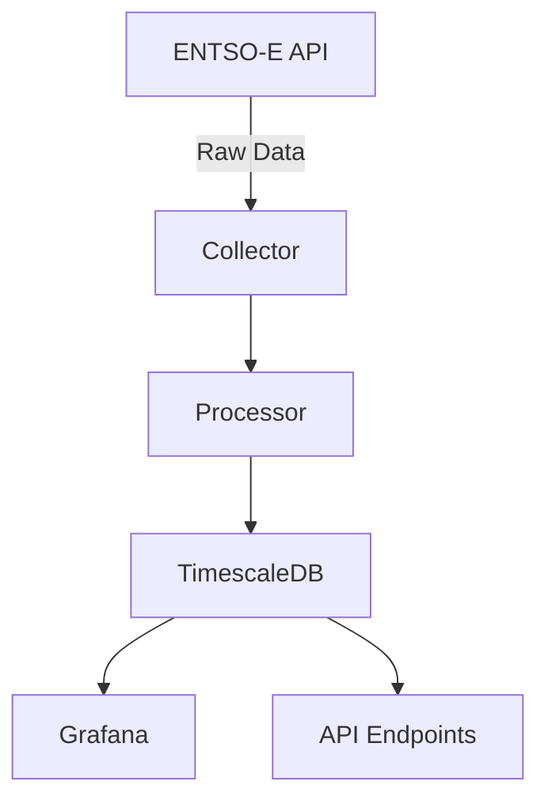

# 🚀 GitHub Pages Documentation Modernization Plan

## **Overview**
Transform your current basic Jekyll/Minima theme documentation into a modern, professional documentation site using the **Just-the-Docs** theme - a highly popular, responsive, and feature-rich documentation theme specifically designed for technical projects.

---

## 📋 **Implementation Steps**

### **Phase 1: Theme Migration & Core Setup**

#### 1.1 Update `_config.yml`
Replace the current Minima theme with Just-the-Docs remote theme:

```yaml
# Replace current theme settings with:
remote_theme: just-the-docs/just-the-docs@v0.7.0

# Add theme-specific configurations
color_scheme: "dark" # Options: light (default), dark, or custom
search_enabled: true
search.heading_level: 2
aux_links:
  "GitHub Repository":
    - "//github.com/AldairPetronilia/trading-project"
aux_links_new_tab: true

# Navigation structure
nav_enabled: true
nav_sort: case_sensitive
back_to_top: true
back_to_top_text: "Back to top"

# Footer configuration
footer_content: "Copyright &copy; 2025 Energy Trading Project. <a href='https://github.com/AldairPetronilia/trading-project/blob/main/LICENSE'>MIT License</a>"
last_edit_timestamp: true
last_edit_time_format: "%b %e %Y at %I:%M %p"
gh_edit_link: true
gh_edit_link_text: "Edit this page on GitHub"
gh_edit_repository: "https://github.com/AldairPetronilia/trading-project"
gh_edit_branch: "main"
gh_edit_source: docs
gh_edit_view_mode: "tree"
```

#### 1.2 Create `Gemfile` in docs folder
```ruby
source "https://rubygems.org"

gem "jekyll", "~> 3.9"
gem "github-pages", group: :jekyll_plugins
gem "jekyll-remote-theme"

group :jekyll_plugins do
  gem "jekyll-feed"
  gem "jekyll-sitemap"
  gem "jekyll-seo-tag"
end
```

---

### **Phase 2: Content Structure Enhancement**

#### 2.1 Restructure Homepage (`index.md`)
Add front matter for better navigation and layout:

```markdown
---
layout: home
title: Home
nav_order: 1
description: "Production-quality energy market data collection system"
permalink: /
---

# Energy Trading Data Platform
{: .fs-9 }

Automated collection, processing, and analysis of European energy market data
{: .fs-6 .fw-300 }

[Get Started](#getting-started){: .btn .btn-primary .fs-5 .mb-4 .mb-md-0 .mr-2 }
[View on GitHub](https://github.com/AldairPetronilia/trading-project){: .btn .fs-5 .mb-4 .mb-md-0 }

---

## 🎯 What is this project?

The Energy Trading Project is a **production-grade data pipeline** that automatically collects, processes, and stores energy market data from ENTSO-E (European electricity grid). Built for traders, analysts, and researchers who need reliable, real-time energy market insights.

### 🚀 Key Capabilities

<div class="code-example" markdown="1">
- **Real-time Data Collection** - Automated fetching every 15 minutes
- **Historical Backfill** - Gap detection and recovery
- **TimescaleDB Storage** - Optimized for time-series queries
- **Grafana Dashboards** - Beautiful data visualization
- **99.9% Uptime** - Production-ready reliability
</div>

## 📊 Use Cases

- **Energy Trading** - Make informed trading decisions with real-time market data
- **Market Analysis** - Identify patterns and trends in energy consumption
- **Research** - Access clean, structured historical energy data
- **Forecasting** - Build ML models with reliable time-series data
```

#### 2.2 Enhanced Getting Started (`getting-started.md`)
```markdown
---
layout: default
title: Getting Started
nav_order: 2
has_children: true
---

# Getting Started
{: .no_toc }

## Table of contents
{: .no_toc .text-delta }

1. TOC
{:toc}

---

## 🎯 Quick Start (5 minutes)

Get the Energy Trading system running in under 5 minutes.

### Prerequisites Check

{: .note }
> **Required Software**
> - Python 3.13+
> - Docker Desktop
> - Git

### 1️⃣ Clone & Setup

```bash
# Clone repository
git clone https://github.com/AldairPetronilia/trading-project.git
cd trading-project

# Install uv (package manager)
curl -LsSf https://astral.sh/uv/install.sh | sh

# Install dependencies
uv sync
```

### 2️⃣ Configure Environment

```bash
# Copy template
cp .env.example .env

# Edit with your ENTSO-E token
nano .env
```

{: .warning }
> **Important**: You need an ENTSO-E API token. [Get one here](https://transparency.entsoe.eu/)

### 3️⃣ Launch Services

```bash
# Start database
docker-compose up -d timescaledb

# Run data collector
uv run python energy_data_service/main.py
```

{: .highlight }
> ✅ **Success!** Data collection starts automatically every 15 minutes
```

#### 2.3 Create subpages for better organization:
- `docs/getting-started/installation.md`
- `docs/getting-started/configuration.md`
- `docs/getting-started/first-run.md`
- `docs/architecture/overview.md`
- `docs/architecture/components.md`
- `docs/architecture/data-flow.md`
- `docs/api/endpoints.md`
- `docs/api/authentication.md`

---

### **Phase 3: Visual Enhancements**

#### 3.1 Add custom color scheme (`_sass/color_schemes/energy.scss`)
```scss
// Energy Trading Theme Colors
$link-color: $blue-000;
$btn-primary-color: $blue-200;

// Dark mode adjustments
$body-background-color: $grey-dk-300;
$body-heading-color: $grey-lt-000;
$body-text-color: $grey-lt-300;
$nav-child-link-color: $grey-dk-000;
$search-background-color: $grey-dk-250;
$table-background-color: $grey-dk-250;
$code-background-color: $grey-dk-250;

// Custom accent colors
$green-000: #41d693;
$green-100: #11b563;
$green-200: #009951;
$green-300: #026e49;
```

#### 3.2 Add custom styles (`_sass/custom/custom.scss`)
```scss
// Hero section
.hero-section {
  background: linear-gradient(135deg, #667eea 0%, #764ba2 100%);
  padding: 3rem 2rem;
  border-radius: 12px;
  margin-bottom: 2rem;
  color: white;
}

// Feature cards
.feature-card {
  border: 1px solid $border-color;
  border-radius: 8px;
  padding: 1.5rem;
  margin-bottom: 1rem;
  transition: transform 0.2s;

  &:hover {
    transform: translateY(-2px);
    box-shadow: 0 4px 12px rgba(0,0,0,0.1);
  }
}

// Code blocks enhancement
pre.highlight {
  border-radius: 8px;
  padding: 1.5rem;
}

// Status badges
.badge {
  display: inline-block;
  padding: 0.25em 0.6em;
  font-size: 0.75rem;
  font-weight: 700;
  border-radius: 0.25rem;

  &.badge-success {
    background-color: $green-100;
    color: white;
  }

  &.badge-warning {
    background-color: $yellow-100;
    color: $grey-dk-300;
  }
}
```

---

### **Phase 4: Interactive Features**

#### 4.1 Add search configuration
Already enabled in config, but enhance with search data:

```yaml
# In _config.yml
search:
  heading_level: 2
  previews: 3
  preview_words_before: 5
  preview_words_after: 10
  tokenizer_separator: /[\s/]+/
  rel_url: true
  button: true
```

#### 4.2 Create interactive API documentation
Add collapsible sections and copy-to-clipboard for code examples:

```markdown
<details open markdown="block">
  <summary>
    Table of contents
  </summary>
  {: .text-delta }
1. TOC
{:toc}
</details>
```

#### 4.3 Add mermaid diagrams support
```markdown


---

### **Phase 5: Navigation & User Experience**

#### 5.1 Create navigation structure
Each file needs front matter:

```yaml
---
layout: default
title: Page Title
parent: Parent Page  # Optional
nav_order: 1
has_children: false
permalink: /path/
---
```

#### 5.2 Add breadcrumbs and navigation helpers
These are automatically included with Just-the-Docs theme.

#### 5.3 Create a custom 404 page (`404.html`)
```html
---
layout: default
title: 404 - Page not found
permalink: /404.html
nav_exclude: true
search_exclude: true
---

<h1>404</h1>
<p><strong>Page not found ☹️</strong></p>
<p>The requested page could not be found.</p>
<p><a href="{{ site.baseurl }}/">Go to homepage</a></p>
```

---

### **Phase 6: Content Improvements**

#### 6.1 Add visual elements:
- **Icons** using Font Awesome or emoji
- **Callout boxes** for important information
- **Code examples** with syntax highlighting
- **Tables** for comparing features/options
- **Screenshots** of Grafana dashboards

#### 6.2 Create additional pages:
- **FAQ page** - Common questions and troubleshooting
- **Changelog** - Version history and updates
- **Contributing guide** - How to contribute to the project
- **Performance metrics** - System capabilities and benchmarks

---

## 🎯 **Expected Outcomes**

### Before → After Comparison:

| Aspect | Current (Minima) | New (Just-the-Docs) |
|--------|-----------------|---------------------|
| **Search** | ❌ None | ✅ Built-in instant search |
| **Navigation** | Basic menu | Sidebar with hierarchy |
| **Mobile** | Basic responsive | Fully optimized |
| **Dark Mode** | ❌ No | ✅ Yes, toggleable |
| **Code Blocks** | Plain | Syntax highlighted with copy button |
| **TOC** | Manual | Auto-generated |
| **Edit Links** | ❌ No | ✅ "Edit on GitHub" buttons |
| **Breadcrumbs** | ❌ No | ✅ Yes |

---

## 📝 **Implementation Order**

1. **Update `_config.yml`** with new theme settings
2. **Create Gemfile** for dependencies
3. **Update index.md** with new homepage layout
4. **Enhance existing pages** with front matter and formatting
5. **Add custom styling** (optional but recommended)
6. **Test locally** before pushing
7. **Deploy to GitHub Pages**

---

## 🚦 **Testing Commands**

```bash
# Test locally
cd docs
bundle install
bundle exec jekyll serve --livereload

# View at http://localhost:4000
```

This plan will transform your documentation from a basic Jekyll site into a modern, professional documentation platform that clearly explains your energy trading project's purpose and capabilities.
